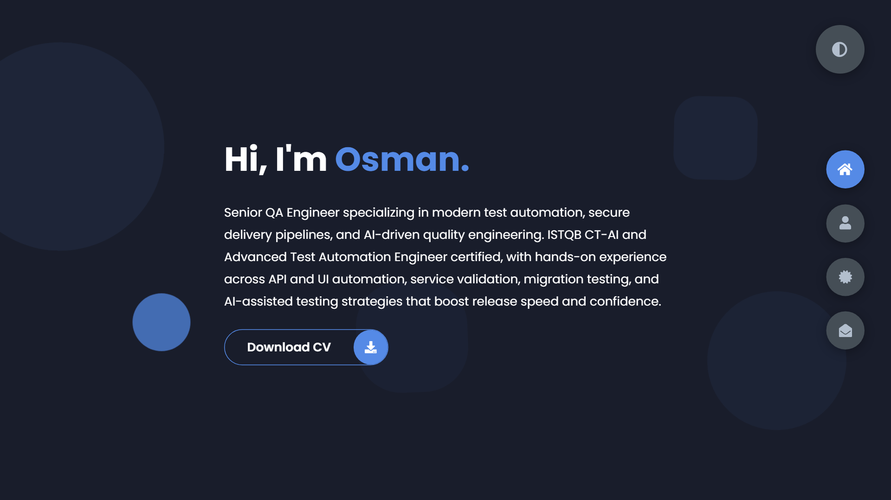

# osmanturalioglu.com

[](https://github.com/Osman19702/my-portfolio/actions/workflows/ci.yml)

Personal portfolio for **Osman Turalioglu**, Senior QA Engineer (ISTQB CT-AI, CTAL-TAE).

**Live:** <https://www.osmanturalioglu.com>



---

## What this is

A single-page portfolio built as a tab interface: one HTML file, one stylesheet, three
small scripts, **no framework and no build step**. The files in the repo root are the
files the browser gets.

It is also a work sample. The owner is a QA engineer, so the repo carries a real test
suite — **113 Playwright tests across 9 spec files**, including accessibility scans of
every panel in both themes, and they run in CI on every push and pull request.

## Stack

| | |
|---|---|
| Markup | Hand-written HTML, single page |
| Styles | Plain CSS with custom properties — **no preprocessor** |
| Scripts | Three vanilla files, no bundler |
| Icons | Inline SVG sprite generated from Font Awesome |
| Hosting | GitHub Pages on a custom domain (`CNAME`) |
| Runtime dependencies | **None** |
| Dev dependencies | Playwright, axe-core, Lighthouse, Font Awesome source |

### Why no build step

GitHub Pages serves whatever is committed. With no compile stage there is nothing that
can be out of sync between source and deployed output, and no build to break before a
deploy. The one generated artifact — the icon sprite — is committed, and its generator
is checked in beside it.

## Running it

```bash
npm install     # dev dependencies only; the site itself needs nothing
npm start       # serves the site at http://127.0.0.1:4173
```

Any static server will do. `npm start` uses a small zero-dependency one in `tests/` so
local and CI behave identically.

## Tests

```bash
npm test          # the whole suite
npm run test:ui   # Playwright's interactive runner
npm run test:a11y # accessibility specs only
npm run test:report  # open the last HTML report
```

Chromium only, to keep installs and CI fast. Add browsers in `playwright.config.js` if
you want cross-browser evidence.

The contact-form specs mock `api.web3forms.com` rather than posting to it, so the suite
sends no mail and stays deterministic. That is also a practical necessity: the endpoint
is behind Cloudflare, which rejects the CORS preflight from a headless user agent. A
live send was verified once, by hand, with a real browser UA.

| Spec | Covers |
|---|---|
| `navigation.spec.js` | The tab contract, ARIA tabs pattern, roving tabindex, arrow keys |
| `accessibility.spec.js` | axe scans of **every panel in both themes**, heading order, skip link, landmarks |
| `contact-form.spec.js` | Validation, spam guards, success / rejection / network failure, busy state |
| `links.spec.js` | CV integrity, external link safety, contact-detail privacy, CSP |
| `theme.spec.js` | Toggle, persistence, OS preference, pre-paint application |
| `responsive.spec.js` | 360 / 768 / 1440 — horizontal scroll and content clipping |
| `seo.spec.js` | Metadata, Open Graph, JSON-LD, robots, sitemap, favicons |
| `console.spec.js` | No console errors, no failed requests |
| `projects.spec.js` | The Projects panel, one card per project (PromptFixer, Elastishot): versioned release or package URL and new-tab safety, version / file / hash copies pinned to each other, the note that says what the visitor gets, 360px fit, axe in both themes |

### Visual check before a release

```bash
npm run visual                        # working tree vs master, i.e. what is deployed
npm run visual -- --against v2026.09  # vs any tag, branch or commit
npm run visual:report                 # open the last report
```

`tests/visual/run.js` drives [Elastishot](https://github.com/Osman19702/elastishot),
a screenshot comparison that aligns the two captures first and names the element
behind every change. It checks out the reference into a temporary worktree, serves it
and the working tree on two ports, and captures every section in both themes at 1440
and 360 px (20 pairs, `elastishot.config.mjs`). Both sides are captured on the same
machine in the same run, so fonts and Chromium cancel out and nothing has to be
committed as a baseline. Exit code 1 means differences; the report in
`.elastishot/runs/latest/index.html` shows them with a slider and the locators.
The same script runs on every pull request in CI against the target branch and
uploads its report as the `elastishot-report` artifact. Elastishot comes from npm
(`elastishot@^0.1.2`, a devDependency).

### Expected failures

None currently. Where a test documents a real, unfixed bug rather than a passing
behaviour, it carries a `test.fail()` annotation naming the defect. If the bug is later
fixed, Playwright reports *"expected to fail but passed"* and forces the annotation to
be removed — so they cannot rot silently. Six were used during this work and all have
now been retired by fixing the underlying bugs.

## Performance

```bash
npm run perf    # Lighthouse, median of 5 runs, writes lighthouse-run.json
```

Replacing the Font Awesome webfont with an inline SVG sprite removed 134 KiB and four
requests:

| | before | after |
|---|---|---|
| Lighthouse performance | 93 | 95 |
| LCP | 3074 ms | 2609 ms |
| Total transfer | 194.4 KiB | 131.6 KiB |
| Requests | 12 | 8 |

Numbers are from a local static server, so absolute values are optimistic against
GitHub Pages; the deltas are what matter.

## Project structure

```
index.html                  the entire page, including the inline icon sprite
app.js                      tab navigation, theme toggle, contact-detail assembly
form-submission.js          contact form validation and submission
notification.js             toast notifications (an ARIA live region)
styles/styles.css           the ONLY stylesheet — see the note below
fonts/                      Poppins, five weights, latin subset, woff2, self-hosted with its OFL licence
img/promptfixer.png         the PromptFixer screenshot on the Projects tab (a real local-model run,
                            made with PromptFixer's scripts/capture-screenshot.mjs; the command is in its header)
img/elastishot.png          the Elastishot screenshot on the Projects tab (a real report from its UI lab,
                            made with Elastishot's scripts/capture-portfolio-shot.mjs; the command is in its header)
scripts/build-icon-sprite.js  regenerates the sprite from Font Awesome
tests/e2e/                  Playwright specs
tests/static-server.js      zero-dependency static server for local and CI runs
tests/lighthouse.js         repeatable performance measurement
docs/MASTER_PROMPT.md       working notes, constraints and the defect backlog
.github/workflows/ci.yml    runs the suite on push and PR
```

### A note on Sass

**There is no Sass in this project, deliberately.** A `styles/styles.scss` used to sit
next to the stylesheet. It was a stale 110-line fragment against 1382 live lines,
naming selectors that no longer existed and declaring an accent colour the site had not
used in years. Compiling it would have replaced the entire stylesheet. It was deleted;
`styles/styles.css` is the single source of truth. Please do not reintroduce a
preprocessor without also removing this note.

### Editing icons

Icons come from an inline sprite in `index.html`, not a webfont or a CDN. The sprite was
generated once by `scripts/build-icon-sprite.js` from the original `<i class="fas …">`
tags. Those tags no longer exist, so the generator now exits with "No Font Awesome `<i>`
tags found" and **must not be run**: it strips the existing sprite before it looks for
anything. To add an icon, copy the `viewBox` and `<path>` from
`node_modules/@fortawesome/fontawesome-free/svgs/<style>/<name>.svg` into a new
`<symbol id="i-<name>">` by hand (see `i-windows`), then reference it with
`<use href="#i-<name>">`.

Font Awesome Free icons are used under **CC BY 4.0**; the attribution is in the sprite.

### Content-Security-Policy

`index.html` declares a strict CSP with no `unsafe-inline`. Anything that adds an inline
script, an inline style attribute, an inline event handler, or a new external origin
will be **blocked** until the policy is updated. The single inline script — the pre-paint
theme setter — is allowed by its `sha256` hash; **if you edit it, regenerate that hash**.

The policy deliberately omits `upgrade-insecure-requests`. It was there briefly and
took the site down: while GitHub was still provisioning the certificate for the custom
domain, Pages served over http, and the directive rewrote every same-origin subresource
to https — into a certificate that did not yet match. The stylesheet and all three
scripts failed and visitors got unstyled markup. It is redundant now that Pages
redirects http to https, and it would turn any future certificate lapse from a warning
into a blank site, so it stays out. A test asserts its absence. Note that the local
suite cannot catch this class of bug at all: the directive exempts localhost.

## Known limitations

Honest list, not a marketing section.

- **The contact form's spam guards are client-side only.** The honeypot and the
  minimum-fill-time check stop bots that drive the form in a browser. Nothing stops a
  script POSTing straight to the Web3Forms endpoint, because the access key is public
  by necessity — it ships in the markup. Web3Forms' own filtering is the only backstop
  there, and the free tier caps submissions per month.
- **Layout is tight at 360px.** The container reserves 80px of horizontal padding at a
  360px viewport, leaving the hero heading a ~220px column. It wraps correctly and
  nothing is cut off, but there is little room to spare on the smallest phones.
- **The CSP is delivered by `<meta>`**, because GitHub Pages cannot set response
  headers. `frame-ancestors` is ignored in a meta policy, so this does not prevent the
  page being framed.
- **Contact-detail obfuscation is partial by design.** Splitting the address and number
  across data attributes defeats scrapers that read raw HTML. It does not defeat one
  that runs JavaScript.
- **No screen-reader testing.** axe is clean across every panel in both themes, but
  automated tools catch roughly a third of real barriers. NVDA and VoiceOver passes have
  not been done.
- **Chromium only** in CI. No Firefox or WebKit evidence.
- **The site requires JavaScript.** Navigation is a tab interface, so without JS only
  the home panel renders.

## Licence

Code is ISC — see [LICENSE](LICENSE).

This does **not** cover the personal content: the CV in `cv/`, the biographical text,
the employment history or the certification details. Those are Osman Turalioglu's and
are not licensed for reuse. Font Awesome icons in the sprite are CC BY 4.0.
